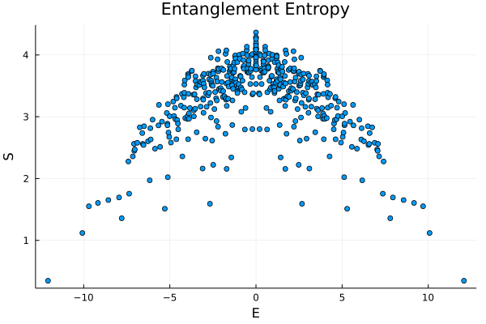

# EDKit.jl

Julia package for general many-body exact diagonalization calculation. The package provide a general Hamiltonian constructing routine for specific symmetry sectors. The functionalities can be extended with user-defined bases.

## Installation

Run the following script in the ```Pkg REPL``` environment:

```julia
pkg> add EDKit
```

## Examples

## XXZ Model with Random Field

Consider the Hamiltonian 
```math
H = \sum_i\left(\sigma_i^x \sigma^x_{i+1} + \sigma^y_i\sigma^y_{i+1} + h_i \sigma^z_i\sigma^z_{i+1}\right).
```
We choose the system size to be ``L=10``. The Hamiltonian need 3 generic information: 

1. Local operators represented by matrices;
2. Site indices where each local operator acts on;
3. Basis, if use the default tensor-product basis, only need to provide the system size.

The following script generate the information we need to generate XXZ Hamiltonian:

```julia
L = 10
mats = [
    fill(spin("XX"), L);
    fill(spin("YY"), L);
    [randn() * spin("ZZ") for i=1:L]
]
inds = [
    [[i, mod(i, L)+1] for i=1:L];
    [[i, mod(i, L)+1] for i=1:L];
    [[i, mod(i, L)+1] for i=1:L]
]
H = operator(mats, inds, L)
```

Then we can use the constructor `operator` to create Hamiltonian:

```julia
julia> H = operator(mats, inds, L)
Operator of size (1024, 1024) with 10 terms.
```

The constructor return an `Operator` object, which is a linear operator that can act on vector/ matrix. For example, we can act `H` on the ferromagnetic state:

```julia
julia> ψ = zeros(2^L); ψ[1] = 1; H * random_state
1024-element Vector{Float64}:
 -1.5539463277491536
  5.969061189628827
  3.439873269795492
  1.6217619009059376
  0.6101231697221667
  6.663735992405236
  ⋮
  5.517409105968883
  0.9498121684380652
 -0.0004996659995972763
  2.6020967735388734
  4.99027405325114
 -1.4831032210847952
```

If we need a matrix representation of the Hamitonian, we can convert `H` to julia array by:

```julia
julia> Array(H)
1024×1024 Matrix{Float64}:
 -1.55617  0.0       0.0       0.0     …   0.0      0.0       0.0
  0.0      4.18381   2.0       0.0         0.0      0.0       0.0
  0.0      2.0      -1.42438   0.0         0.0      0.0       0.0
  0.0      0.0       0.0      -1.5901      0.0      0.0       0.0
  0.0      0.0       2.0       0.0         0.0      0.0       0.0
  0.0      0.0       0.0       2.0     …   0.0      0.0       0.0
  ⋮                                    ⋱                     
  0.0      0.0       0.0       0.0         0.0      0.0       0.0
  0.0      0.0       0.0       0.0         2.0      0.0       0.0
  0.0      0.0       0.0       0.0     …   0.0      0.0       0.0
  0.0      0.0       0.0       0.0        -1.42438  2.0       0.0
  0.0      0.0       0.0       0.0         2.0      4.18381   0.0
  0.0      0.0       0.0       0.0         0.0      0.0      -1.55617
```

Or use the function `sparse` to create the sparse matrix (requires the module `SparseArrays` being imported):

```julia
julia> sparse(H)
1024×1024 SparseMatrixCSC{Float64, Int64} with 6144 stored entries:
⠻⣦⣄⣀⠀⠀⠀⠀⠀⠀⠀⠀⠀⠳⣄⠀⠀⠀⠀⠀⠀⠀⠀⠀⠀⠀
⠀⢹⡻⣮⡳⠄⢠⡀⠀⠀⠀⠀⠀⠀⠈⠳⣄⠀⠀⠀⠀⠀⠀⠀⠀⠀
⠀⠀⠙⠎⢿⣷⡀⠙⢦⡀⠀⠀⠀⠀⠀⠀⠈⠳⣄⠀⠀⠀⠀⠀⠀⠀
⠀⠀⠀⠲⣄⠈⠻⣦⣄⠙⠀⠀⠀⢦⡀⠀⠀⠀⠈⠳⣄⠀⠀⠀⠀⠀
⠀⠀⠀⠀⠈⠳⣄⠙⡻⣮⡳⡄⠀⠀⠙⢦⡀⠀⠀⠀⠈⠳⣄⠀⠀⠀
⠀⠀⠀⠀⠀⠀⠀⠀⠙⠮⢻⣶⡄⠀⠀⠀⠙⢦⡀⠀⠀⠀⠈⠳⣄⠀
⢤⡀⠀⠀⠀⠀⠠⣄⠀⠀⠀⠉⠛⣤⣀⠀⠀⠀⠙⠂⠀⠀⠀⠀⠈⠓
⠀⠙⢦⡀⠀⠀⠀⠈⠳⣄⠀⠀⠀⠘⠿⣧⡲⣄⠀⠀⠀⠀⠀⠀⠀⠀
⠀⠀⠀⠙⢦⡀⠀⠀⠀⠈⠳⣄⠀⠀⠘⢮⡻⣮⣄⠙⢦⡀⠀⠀⠀⠀
⠀⠀⠀⠀⠀⠙⢦⡀⠀⠀⠀⠈⠳⠀⠀⠀⣄⠙⠻⣦⡀⠙⠦⠀⠀⠀
⠀⠀⠀⠀⠀⠀⠀⠙⢦⡀⠀⠀⠀⠀⠀⠀⠈⠳⣄⠈⢿⣷⡰⣄⠀⠀
⠀⠀⠀⠀⠀⠀⠀⠀⠀⠙⢦⡀⠀⠀⠀⠀⠀⠀⠈⠃⠐⢮⡻⣮⣇⠀
⠀⠀⠀⠀⠀⠀⠀⠀⠀⠀⠀⠙⢦⠀⠀⠀⠀⠀⠀⠀⠀⠀⠉⠙⠻⣦
```


## Solving AKLT Model Using Symmetries

Consider the AKLT model 
```math
H = \sum_i\left[\vec S_i \cdot \vec S_{i+1} + \frac{1}{3}\left(\vec S_i \cdot \vec S_{i+1}\right)^2\right],
```
with system size chosen to be ``L=8``. The Hamiltonian operator for this translational-invariant Hamiltonian can be constructed using the `trans_inv_operator` function:

```julia
L = 8
SS = spin((1, "xx"), (1, "yy"), (1, "zz"), D=3)
mat = SS + 1/3 * SS^2
H = trans_inv_operator(mat, 1:2, L)
```

The second input specifies the indices the operators act on.

Because of the translational symmetry, we can simplify the problem by considering the symmetry. We construct a translational-symmetric basis by:

```julia
B = TranslationalBasis(L=8, k=0, base=3)
```

Here, `L` is the length of the system, and `k` labels the momentum ``k = 0,...,L-1`` (integer multiply of 2π/L). The function `TranslationalBasis` return a basis object containing 834 states. We can obtain the Hamiltonian in this sector by:

```julia
julia> H = trans_inv_operator(mat, 1:2, B)
Operator of size (834, 834) with 8 terms.
```

In addition, we can take into account the total ``S^z`` conservation, by constructing the basis

```julia
B = TranslationalBasis(L=8, N=8, k=0, base=3)
```

where the `N` is the filling number with respect to all-spin-down state. N=L means we select those states whose total `Sz` equalls 0 (note that we use 0,1,2 to label the `Sz=1,0,-1` states). This gives a further reduced Hamiltonian matrix:

```julia
julia> H = trans_inv_operator(mat, 1:2, B)
Operator of size (142, 142) with 8 terms.
```

We can go on step further by considering the spatial reflection symmetry.

```julia
B = TranslationParityBasis(L=8, N=0, k=0, p=1, base=3)
```

where the `p` argument is the parity `p = ±1`.

```julia
julia> H = trans_inv_operator(mat, 1:2, B)
Operator of size (84, 84) with 8 terms.
```


## PXP Model and Entanglement Entropy

Consider the PXP model
```math
H = \sum_i \left(P^0_{i-1} \sigma^x_i P^0_{i+1}\right).
```
Note that the model is defined on the Hilbert space where there is no local ``|↑↑⟩`` configuration. For system size ``L=20`` and in sector ``k=0,p=+1``, the Hamiltonian is constructed by:
```julia
mat = begin
    P = [1 0; 0 0]
    kron(P, spin("X"), P)
end
pxpf(v::Vector{<:Integer}) = all(v[i]==0 || v[mod(i, length(v))+1]==0 for i=1:length(v))
basis = TranslationParityBasis(L=20, f=pxpf, k=0, p=1)
H = trans_inv_operator(mat, 3, basis)
```
where `f` augument is the selection function for the basis state that can be user defined. We can then diagonalize the Hamiltonian. The bipartite entanglement entropy for each eigenstates can be computed by
```julia
vals, vecs = Array(H) |> Hermitian |> eigen
EE = [ent_S(vecs[:,i], 1:L÷2, basis) for i=1:size(basis,1)]
scatter(vals, EE, xlabel="E",ylabel="S",legend=false)
```

The plot is


